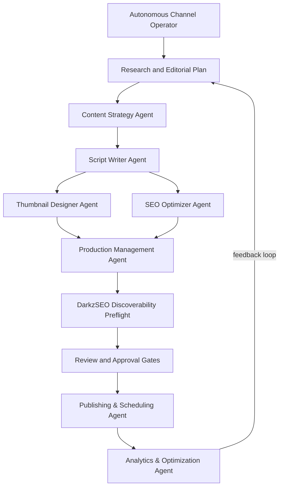
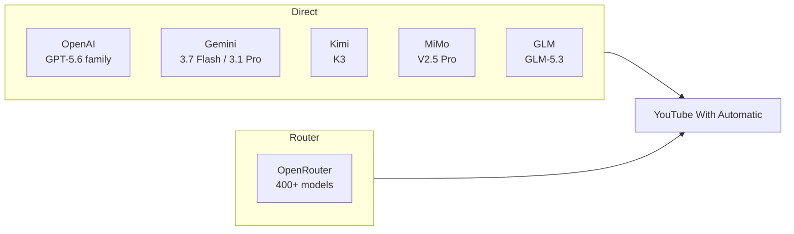
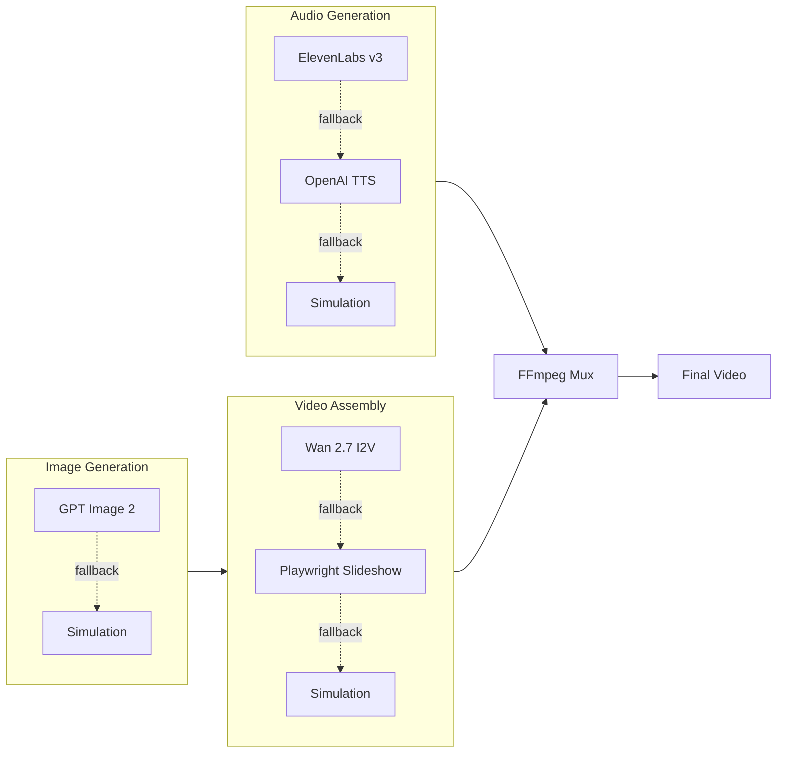

# YouTube With Automatic

**The open-source AI agent that runs a YouTube channel end to end.**

Research topics → write scripts → generate narration and visuals → assemble videos → optimize metadata → review → schedule → publish → learn from analytics and from what your audience says.

[](LICENSE)
[](package.json)

## What's new

- **v2.10.0:** DarkzSEO discoverability audits, controlled growth experiments, and outcome-aware channel operation are available together in the approval-first workflow.

## What's new in v2.10.0

**Automic now has a discoverability adapter layer.** v2.10.0 connects the production pipeline to DarkzSEO without merging the projects or weakening human review, then adds the evidence needed to prove what packaging and strategy actually work:

- **DarkzSEO Discoverability Preflight:** send a canonical content package—not the private dashboard—through versioned GEO, AIO, AEO, and web-search checks after metadata and provenance are assembled.
- **Reviewable evidence:** persist stable rule IDs, severity, engine/schema identity, fingerprints, and operator decisions in SQLite. Keep a finding actionable or dismiss a false positive with a reason that carries into matching future audits.
- **Safe local adapter boundary:** invoke DarkzSEO through JSON-only stdin/stdout without a shell or inherited API secrets. Missing Python, timeouts, and schema drift stay explicit and non-blocking.
- **Controlled Growth Experiments Studio:** rotate only approved title/thumbnail arms, measure real interval evidence, restore the control, and require a separate decision before adopting a winner.
- **Outcome & ROI Studio:** align the operator with a measurable KPI, target window, budget, and available revenue/cost evidence without converting missing economics into false zeroes.
- **Platform-ready foundation:** audits already retain their target platform, providing the durable contract for planned TikTok and Instagram/Reels publishing and analytics adapters.

DarkzSEO is optional. Install DarkzSEO 1.4+ into Python or set `DARKZSEO_PATH`; when it is unavailable, Automic records the reason and keeps the existing approval workflow operational.

See the complete release history in [CHANGELOG.md](CHANGELOG.md).

- **Self-hosted:** your credentials, media, and channel data stay under your control.
- **Approval-first:** nothing is scheduled until quality, rights, and human-review gates pass by default.
- **Strategy-driven:** give the Autonomous Channel Operator an objective, audience, pillars, cadence, and guardrails; it turns them into researched content plans and production runs.
- **Provider-flexible:** use Gemini, OpenAI, OpenRouter, Kimi, MiMo, GLM, or another OpenAI-compatible text endpoint, plus Seedance, MiniMax H3, Gemini Omni Flash, Kling, Wan, or local FFmpeg for video.
- **Observable:** follow persistent generation jobs, failures, review state, publishing, and local activation milestones from the dashboard.

<!-- Launch gate: add only a real 30–45 second dashboard demo captured from a verified end-to-end run. -->

## Quick start

```bash
git clone <your-repo-url>
cd youtube-with-automatic
npm install
npx playwright install chromium
npm run walkthrough
npm start
```

Open `http://localhost:3456`. The walkthrough explains each provider choice, tests credentials, and guides YouTube authorization.

Already know what you are doing? `npm run setup` offers a shorter classic flow, and `.env.example` documents every setting.

The `npx playwright install chromium` step is required for the free **local slideshow** video path (no paid video provider needed) — without it, video generation falls through to a simulated placeholder that cannot be approved or published. Skip it only if you already have a paid video provider configured. The startup **Capability check** reports whether Chromium is installed.

### Windows quick start

Run these in **PowerShell**:

```powershell
git clone <your-repo-url>
cd youtube-with-automatic
npm install
npx playwright install chromium
npm run walkthrough
npm start
```

Prerequisites: [Node.js 18+](https://nodejs.org/) and [Git](https://git-scm.com/download/win). `npm install` also fetches a bundled FFmpeg binary automatically — no separate install needed. If PowerShell blocks the npm-generated scripts with an execution-policy error, run `Set-ExecutionPolicy -Scope CurrentUser RemoteSigned` once and re-open the terminal.

### Verify production readiness

Before activating autonomous production, open **Production readiness** in the dashboard and choose **Run verified check**. The gate makes small live text and narration requests, verifies access to the connected YouTube channel, creates and decodes a temporary MP4 containing audio and video, and validates every queued upload's metadata. It never creates or uploads a YouTube video, and temporary probe assets are deleted after the run.

AI image generation can incur a larger provider charge, so its live probe is a separate opt-in checkbox. Without that checkbox, image configuration is reported as verified, skipped, or using the built-in gradient fallback without making a paid image request.

AI video verification has its own **Include paid video probe** checkbox. When enabled, Automic creates the provider's shortest supported test clip, records the external task and model, downloads and decodes the MP4, then removes the temporary asset. It never silently tries a second paid provider.

Results persist locally in SQLite with exact remediation steps. A recorded blocking failure stops autonomous generation and publishing until a later run passes; manual work remains available when readiness has never been checked or the last result is older than 24 hours.

### Resume an interrupted production

Every generation stage writes a local SQLite checkpoint. If a provider times out or the application restarts, the dashboard shows the saved-stage count and the first incomplete stage. Choose **Resume** to continue from there, or select an earlier stage when you intentionally want to regenerate that stage and everything after it. Saved files are validated before reuse; missing artifacts are regenerated automatically.

Autonomous Operator runs preserve their research and editorial plan, so **Resume run** continues unfinished plan items instead of researching and generating completed videos again. Publishing remains fail-closed: if an upload may have reached YouTube but no video ID was returned, Automic requires channel reconciliation before another upload attempt.

### Repair one scene without starting over

Every production now keeps a durable scene manifest with its narration, visual prompt, timing, provider/task identity, asset origin, rights state, evidence links, and revision history. Open **Scene Repair Studio** inside Review Studio to edit a scene, change its order, lock a scene that already works, upload a licensed replacement asset, or regenerate only that scene.

Paid video regeneration always shows the provider and generated seconds and requires a separate confirmation. Uploaded assets require an explicit rights confirmation. Narration edits invalidate that scene's audio and factual review; live narration must be regenerated and any new factual claim must be reviewed against verified evidence before approval.

Narration is fail-closed. Automic records the TTS provider, model, external task when available, generation time, cost evidence, and failure reason for every scene. If narration is missing, simulated, stale, or failed, the production cannot be approved, scheduled, or published. Use **Regenerate narration only** to repair the audio without spending video-generation credits or replacing a visual.

An intentionally silent production requires a separate operator confirmation and a stored reason of at least 10 characters. The override remains visible in Review Studio, can be reversed, and is included in the narration revision history. Silence is never inferred from a failed provider call.

When the timeline is ready, **Rebuild final video** creates a new MP4 and scene-aware captions while preserving the previous final video path in the production record. Approval stays blocked while any scene is missing, generating, stale, failed, or waiting for rebuild. Approved or scheduled productions are locked against scene repair.

### Repurpose an approved video into Shorts

Open **Shorts Repurposing Studio** inside Review Studio and choose **Create 3 Short drafts**. Automic selects self-contained windows from the durable scene timeline and preserves the exact source-scene IDs, start time, duration, rationale, title, description, tags, layout, and inherited review evidence for each candidate. Draft selection is local and does not call an AI provider.

Choose a blurred-canvas, center-crop, or stacked-focus layout, then render a real 9:16 MP4 with mobile-safe burned captions and a separate SRT file. The source video and narration are reused, so the default workflow does not spend new image, video, or TTS credits. Changing the layout invalidates the prior render and requires a fresh local render.

Every Short has its own approval and schedule. Scheduling remains blocked until the source production is approved, provenance is resolved, uploaded media rights are confirmed, every source scene is current, and the operator explicitly confirms the Short's privacy and publish time. Published Shorts retain their parent-production identity while their analytics use a separate Shorts baseline.

### Review research and provenance

Every production has an **Evidence desk** inside Review Studio. Autonomous research carries exact YouTube source metadata into the production, while AI-generated scripts list the factual claims that need review. Add any official articles, datasets, asset licenses, or other evidence that the script needs, verify each source, and connect it to the claims it supports.

A claim can be approved only when it links to a verified source. Unsupported claims remain blocking, and an intentional waiver requires a reviewer note. Productions with no externally verifiable factual claims are marked as not requiring provenance review. The separate factual-review and media-rights attestations remain required before scheduling.

Use the altered or synthetic media control only when the video contains realistic content that requires YouTube disclosure. The selected value is preserved in the publishing queue and included in the YouTube upload request.

### Review discoverability guidance

Every saved production receives an optional **DarkzSEO Discoverability Preflight** in Review Studio after metadata and provenance are assembled. The adapter sends a canonical content package—not the private dashboard—to DarkzSEO's versioned JSON API and stores the engine version, schema version, severity summary, stable rule IDs, and individual findings in SQLite.

Findings are advisory in this release. Keep a useful recommendation as actionable, or dismiss a false positive with a reviewer reason that carries forward to matching findings on later audits. Missing Python, an unavailable DarkzSEO installation, timeouts, and schema mismatches remain explicit without blocking publication or silently changing scripts and metadata.

For local development with a sibling checkout:

```bash
python -m pip install -e ../darkzseo
```

Alternatively set `DARKZSEO_PATH` to `darkzseo.py`. The adapter uses a shell-free Python child process, sends content JSON over stdin, and reads JSON-only stdout. DarkzSEO 1.4 or newer is required.

### What you need

- Node.js 18+
- A Google account and YouTube Data API credentials
- At least one AI text provider key
- FFmpeg, installed automatically through `ffmpeg-static`
- Python 3.9+ and DarkzSEO 1.4+ for the optional discoverability preflight

Gemini offers free access for supported text and TTS usage. Gemini AI image generation currently requires paid-tier access; without an image provider, Automic can assemble gradient-based visuals instead.

### Run the Autonomous Channel Operator

Open **Autonomous operator** in the dashboard and describe the channel outcome—not a task list. Set the objective, audience, content pillars, publishing cadence, success metric, and boundaries, then choose **Activate & run now**.

Automic refreshes YouTube trend and configured-competitor signals, checks recent channel topics, creates an evidence-labeled editorial plan, and sends each planned video through strategy, script, thumbnail, SEO, production, and workflow management. Active strategies also guide scheduled generation at the requested weekly cadence. Operator runs, decisions, progress, and failures persist in SQLite and remain visible in the dashboard.

By default, finished videos wait for factual review, media-rights confirmation, and approval. Once approved, the existing publishing agent schedules and uploads them. Turning on autonomy does not bypass those gates, and simulated videos still cannot publish.

### Close the performance loop

After publication, Automic captures comparable 24-hour and 7-day performance snapshots. It evaluates CTR, retention, engagement, watch time, format, length, hook style, and title style against the channel's own history—not a universal view-count target.

Open **Analytics → What the agent learned** to review the evidence and confidence behind each recommendation. Pending or rejected recommendations never influence generation. Once you approve one, the next Autonomous Channel Operator run includes it as an explicit planning constraint. Simulated analytics fallbacks are stored as unverified and are never eligible for baselines or recommendations.

When an approved learning calls for better packaging, Automic prepares a control plus title and thumbnail variants for new videos. Review Studio shows those options before approval; the selected combination is the only one handed to the publishing queue. Automic does not silently swap live YouTube metadata.

### Prove a growth recommendation

Open **Analytics → Controlled Growth Experiments** after a video with approved-learning packaging variants is published. Create a draft plan with a 24–168 hour window per arm and a minimum-impressions threshold, review the exact title and thumbnail combinations, then separately approve and start the live test.

Automic records a cumulative analytics sample before and after each arm and evaluates only the interval delta. Every arm must reach the configured impression and click floor. The leading CTR must clear a 95% evidence threshold without a material retention regression or traffic-source shift; otherwise the result is explicitly **inconclusive**. Simulated analytics never advance an experiment.

Arm rotations are limited to the plan you approved. After the final arm, Automic restores the control title and thumbnail before presenting the result. Applying the winner is a separate confirmation; only then does the validated packaging pattern become an approved learning for future Autonomous Operator runs. Experiment state and evidence are stored in SQLite so restarts do not erase progress.

### Align the channel with outcomes and ROI

The Autonomous Operator strategy can define a measurable primary outcome—views, watch hours, net subscribers, engagement rate, or estimated revenue—plus a numeric target, evidence window, monthly production budget, and currency. The existing free-text outcome context remains available for goals that need human nuance.

At each real analytics window, Automic stores subscriber gains and losses, watch hours, monetization evidence when the channel exposes it, and known production costs from durable scene records. **Analytics → Outcome & ROI Studio** shows target progress, evidence coverage, net subscribers, estimated revenue, known cost, ROI, and comparisons by content pillar, format, and production provider.

Missing evidence is explicit. A channel without monetization access shows revenue as unavailable rather than zero, and ROI stays unavailable until both revenue and complete cost evidence exist. When at least two comparable videos exist in each group, the learning engine can propose reallocating future content toward the pillar or format that best advances the configured outcome. That proposal remains pending until you approve it; Automic never changes the strategy or budget silently.

### Find the exact scene that lost viewers

At each real analytics window, Automic also requests YouTube's audience-retention curve and maps its 100 elapsed-time points onto the stored scene durations. Open **Analytics → Scene-aware retention** to see the curve divided by scene, compare absolute and relative retention, and inspect drop-off, rewatch, strong-hold, or steady signals for each beat.

Retention snapshots are stored separately for long-form videos and Shorts. Missing, sparse, or simulated curves never enter this evidence layer. A scene finding creates a pending learning recommendation; it cannot guide future scripts, pacing, or scene structure until the operator approves it, and Automic never rewrites a published video. Use **Refresh curve** for a read-only update from YouTube Analytics, or `GET /api/retention/:videoId` to inspect stored evidence.

### Engage with your audience

Open **Engagement** in the dashboard. Automic syncs comments for recently published videos every four hours (more often for fresh videos) and classifies them into themes, sentiment, and questions. Likely spam, scams, and toxic comments are quarantined into a separate needs-attention list — Automic never deletes or hides a comment; acting on flagged comments stays in YouTube Studio.

Choose **Draft replies** to generate suggested answers in your channel's voice. Nothing posts automatically: every reply waits in the queue where you can edit, discard, or approve it, and approval requires an explicit confirmation. Posting requires re-authorizing YouTube once to grant the comment permission (`youtube.force-ssl`); until then the studio works in read-and-draft mode. A daily posting cap (default 50, `ENGAGEMENT_DAILY_REPLY_CAP`) keeps approval sessions bounded.

When three or more commenters ask for the same thing, the analysis mines an **audience-requested idea** with comment permalinks as evidence. Like every other learning, it stays pending until you approve it — only then can the Autonomous Channel Operator plan a video that answers it. If no AI text provider is configured, comment sync still works, but the studio records only mechanical facts and never invents themes, drafts, or ideas.

## From idea to published video

| Stage | What Automic does | What you control |
| --- | --- | --- |
| Research | Finds topics and builds a content strategy | Niche, audience, blocked topics |
| Script | Writes the hook, narrative, CTA, and metadata | Voice, format, length, brand direction |
| Production | Generates narration and visuals, then assembles a real MP4 | Provider choice and media fallbacks |
| Review | Runs quality checks and opens the video in Review Studio | Facts, media rights, edits, approval |
| Publish | Schedules and uploads approved content | Privacy, timing, final decision |
| Learn | Captures 24-hour and 7-day evidence, measures the configured outcome and economics, then proposes the next move | Choose the KPI and approve or reject each learning before it guides planning |

Automic distinguishes real MP4 output from simulated placeholders. Simulated output cannot enter the approval or publishing path.

For release history, see [CHANGELOG.md](CHANGELOG.md).

## Architecture



## How It Works

Each agent handles one stage of the pipeline:

| Agent | Role |
|-------|------|
| **Content Strategy** | Analyzes YouTube trends, identifies topics, plans content calendar |
| **Script Writer** | Generates scripts with hooks, storytelling, CTAs |
| **Thumbnail Designer** | Creates thumbnails, runs A/B variations |
| **SEO Optimizer** | Keywords, titles, descriptions, tags |
| **Production** | Coordinates TTS audio, image assets, video assembly |
| **Discoverability** | Runs versioned, advisory GEO/AIO/AEO content audits through DarkzSEO |
| **Publishing** | Uploads, schedules, manages playlists |
| **Analytics** | Tracks performance, feeds insights back to strategy |

## AI Providers

All OpenAI-compatible providers work out of the box — the system auto-configures the SDK base URL. Pick one, or use OpenRouter to access everything through a single key.



| Provider | Models | Base URL | Cost |
|----------|--------|----------|------|
| **OpenAI** | GPT-5.6 Sol, Terra, Luna | `api.openai.com/v1` | provider pricing |
| **OpenRouter** | 400+ models; curated defaults are validated against its live catalog | `openrouter.ai/api/v1` | varies by model |
| **Google Gemini** | Gemini 3.7 Flash, 3.1 Pro Preview, 3.5 Flash-Lite | via `@google/genai` SDK | free tiers vary by model and modality |
| **Kimi (Moonshot AI)** | Kimi K3, K2.7 Code, K2.6 | `api.moonshot.ai/v1` | provider pricing |
| **MiMo (Xiaomi)** | MiMo V2.5 Pro, V2.5 | `api.xiaomimimo.com/v1` | provider pricing |
| **GLM (Zhipu AI)** | GLM-5.3, 5.2, 5.1 | `api.z.ai/api/paas/v4/` | provider pricing |

Additional integrations: Anthropic Claude (`claude-fable-5`), ElevenLabs (Eleven v3 TTS), Replicate (Wan 2.7 video), local models via Ollama, any OpenAI-compatible endpoint.

### AI video providers

Local slideshow rendering remains the default, so upgrading does not start paid video requests. Choose a provider in **Channel setup**, set a paid-seconds cap, then run the separately opted-in paid video readiness probe.

| Provider | Default model | Best fit | Clip limits |
| --- | --- | --- | --- |
| ByteDance | `bytedance/seedance-2.5` through Replicate | Cinematic long scenes and large reference sets | 4–30 seconds |
| MiniMax | `MiniMax-H3` | Multimodal references, native stereo audio, optional 2K | 4–15 seconds |
| Google | `gemini-omni-flash-preview` | Fast generation and conversational editing | 3–10 seconds |
| Kuaishou | `kling-v3-omni` | Storyboards and character/voice consistency | 3–15 seconds |
| Alibaba | Wan 2.7 task-specific models | Efficient generation, reference video, and continuation | 2–15 seconds |

Long-form productions use hybrid assembly: Automic generates bounded provider clips for the hook and important sections, fills the remaining timeline locally, mixes the existing narration, and keeps the generated caption file alongside the production. As soon as a provider returns its task ID, Automic persists it before polling so interrupted jobs can resume that known task instead of submitting it again.

## Configuration

### API Keys

#### YouTube Data API (required, free)

1. Create a project in [Google Cloud Console](https://console.cloud.google.com/)
2. Enable **YouTube Data API v3**
3. Create an OAuth 2.0 client (Desktop app)
4. Save the JSON as `config/credentials.json`

#### OpenAI

1. Get a key from [platform.openai.com](https://platform.openai.com/)
2. Set `OPENAI_API_KEY` in `.env`

#### OpenRouter (easiest — one key, all models)

1. Get a key from [openrouter.ai/keys](https://openrouter.ai/keys)
2. Set `OPENROUTER_API_KEY` in `.env`

#### Google Gemini

1. Get a key from [Google AI Studio](https://aistudio.google.com/)
2. Set `GEMINI_API_KEY` in `.env`

#### Kimi / MiMo / GLM

| Provider | Get key at | Env var |
|----------|-----------|---------|
| Kimi (Moonshot AI) | [platform.kimi.ai](https://platform.kimi.ai) | `MOONSHOT_API_KEY` |
| MiMo (Xiaomi) | [mimo.mi.com](https://mimo.mi.com) | `MIMO_API_KEY` |
| GLM (Zhipu AI) | [z.ai](https://z.ai) | `GLM_API_KEY` |

### Environment Variables

```env
# AI provider — pick one (or use OpenRouter for access to all)
OPENAI_API_KEY=sk-...
# OPENROUTER_API_KEY=sk-or-...
# GEMINI_API_KEY=...
# MOONSHOT_API_KEY=...
# MIMO_API_KEY=...
# GLM_API_KEY=...

# Optional: premium TTS
# ELEVENLABS_API_KEY=...
# ELEVENLABS_VOICE_ID=...

# Optional: AI video generation
# VIDEO_PROVIDER=slideshow # auto, seedance, minimax_h3, google_omni, kling, wan
# VIDEO_GENERATION_MODE=hybrid
# VIDEO_MAX_GENERATED_SECONDS=60
# REPLICATE_API_TOKEN=...  # Seedance 2.5
# MINIMAX_API_KEY=...      # MiniMax H3
# KLING_ACCESS_KEY=...
# KLING_SECRET_KEY=...
# DASHSCOPE_API_KEY=...    # Wan 2.7

# App config
NODE_ENV=production
PORT=3456
CHANNEL_NAME=Your Channel Name
TARGET_AUDIENCE=Your target audience
YOUTUBE_REGION=US
DEFAULT_PRIVACY_STATUS=private

# Optional recovery tuning (defaults shown)
MAX_CONCURRENT_JOBS=1
GENERATION_STAGE_MAX_ATTEMPTS=2
GENERATION_RETRY_BASE_MS=1000

# Optional: protect mutating API routes (POST /generate, /publish)
# API_KEY=some-long-random-string

# Optional anonymous activation milestones (off by default; HTTPS endpoint required)
# ANONYMOUS_TELEMETRY_ENABLED=false
# ANONYMOUS_TELEMETRY_ENDPOINT=https://your-collector.example/events
```

### Activation measurement and privacy

The dashboard calculates setup, first-real-MP4, approval, publication, and repeat-generation milestones locally from SQLite and files on disk. A video counts only when a non-simulated `.mp4` with an MP4 container signature still exists.

Anonymous milestone reporting is disabled by default and has no built-in collector. It activates only when you explicitly set both telemetry variables. The allowlisted payload contains the milestone name and time, Automic version, OS family, Node major version, and a random installation ID. It never includes credentials, channel data, prompts, topics, titles, filenames, or video contents.

## Automation Schedule

```mermaid
gantt
    title Daily Pipeline
    dateFormat HH:mm
    axisFormat %H:%M

    section Content
    Generate content (strategy + script + thumbnail + SEO) :06:00, 2h

    section Publishing
    Process publishing queue :crit, 08:00, 14h

    section Analytics
    Collect analytics     :09:00, 1h
    Run optimizations     :22:00, 1h
```



The scheduler runs automatically after `npm start`. Content generation at 06:00, publishing queue processed every 15 minutes, analytics at 09:00, optimization at 22:00. Weekly strategy reviews run on Sundays.

When an active channel strategy exists, the 06:00 generation check uses its cadence and launches an autonomous research-and-production run when the content buffer needs work. Without an active strategy, the original topic-selection flow remains in place.

Daily analytics collection backfills each real publication's 24-hour and 7-day evidence windows. Recommendations require at least two real measurements, and format or style comparisons require at least two videos in each compared group.

## API

```bash
# health check
curl http://localhost:3456/health

# queue a video-generation job (send x-api-key if API_KEY is set in .env)
curl -X POST http://localhost:3456/generate \
  -H "Content-Type: application/json" \
  -H "x-api-key: $API_KEY" \
  -d '{"topic": "Top 10 Life Hacks", "style": "list"}'

# inspect the returned background job
curl http://localhost:3456/api/jobs/:jobId

# resume a failed/interrupted job from its first incomplete checkpoint
curl -X POST http://localhost:3456/api/jobs/:jobId/resume \
  -H "Content-Type: application/json" \
  -H "x-api-key: $API_KEY" \
  -d '{}'

# intentionally regenerate a selected stage and everything after it
curl -X POST http://localhost:3456/api/jobs/:jobId/resume \
  -H "Content-Type: application/json" \
  -H "x-api-key: $API_KEY" \
  -d '{"stage":"thumbnail"}'

# inspect the latest production-readiness evidence
curl http://localhost:3456/api/readiness

# run harmless live probes; add {"includePaidMedia":true} only to test paid image generation
curl -X POST http://localhost:3456/api/readiness/run \
  -H "Content-Type: application/json" \
  -H "x-api-key: $API_KEY" \
  -d '{"includePaidMedia":false}'

# save a channel strategy
curl -X PUT http://localhost:3456/api/operator/strategy \
  -H "Content-Type: application/json" \
  -H "x-api-key: $API_KEY" \
  -d '{"objective":"Own practical AI automation for small teams","audience":"Small business operators","contentPillars":["AI workflows","Automation playbooks"],"cadencePerWeek":2,"videosPerRun":2,"defaultFormat":"tutorial","defaultLength":"medium","primaryKpi":"subscribers","targetValue":100,"targetWindowDays":28,"monthlyBudget":250,"outcomeCurrency":"USD","status":"draft"}'

# activate the saved strategy and start a background operator run
curl -X POST http://localhost:3456/api/operator/start \
  -H "Content-Type: application/json" \
  -H "x-api-key: $API_KEY" \
  -d '{}'

# resume an interrupted operator run from its saved plan
curl -X POST http://localhost:3456/api/operator/runs/:runId/resume \
  -H "x-api-key: $API_KEY"

# view schedule
curl http://localhost:3456/schedule

# get analytics
curl http://localhost:3456/analytics

# get the goal-aligned Outcome & ROI Studio summary
curl http://localhost:3456/api/outcomes

# approve an evidence-backed learning for future autonomous plans
curl -X POST http://localhost:3456/api/learning/recommendations/:recommendationId/approve \
  -H "x-api-key: $API_KEY"

# inspect controlled experiments and eligible published videos
curl http://localhost:3456/api/experiments

# create and approve a packaging test plan (start/adopt are separate confirmed actions)
curl -X POST http://localhost:3456/api/experiments \
  -H "Content-Type: application/json" -H "x-api-key: $API_KEY" \
  -d '{"productionId":"production-id","armDurationHours":48,"minImpressions":1000}'
curl -X POST http://localhost:3456/api/experiments/:experimentId/approve \
  -H "Content-Type: application/json" -H "x-api-key: $API_KEY" \
  -d '{"confirmed":true}'

# inspect, edit, and approve content before scheduling
curl http://localhost:3456/api/content/:contentId
curl -X POST http://localhost:3456/api/content/:contentId/approve \
  -H "Content-Type: application/json" \
  -H "x-api-key: $API_KEY" \
  -d '{"privacyStatus":"private","factChecked":true,"rightsConfirmed":true}'
```

## Production Pipeline



Each stage has graceful fallbacks. If a paid API key isn't configured, the system simulates that step so the rest of the pipeline still runs.

## Extending

### Custom AI provider

```javascript
// utils/ai-service.js
const Anthropic = require('@anthropic-ai/sdk');

class ClaudeAIService {
  constructor(apiKey) {
    this.client = new Anthropic({ apiKey });
  }
  async generateContent(prompt) {
    const message = await this.client.messages.create({
      model: 'claude-fable-5',
      max_tokens: 1024,
      messages: [{ role: 'user', content: prompt }]
    });
    return message.content[0].text;
  }
}
```

### Custom content types

```javascript
// agents/content-strategy-agent.js
const contentTypes = {
  'podcast': {
    duration: '10-15 minutes',
    style: 'conversational',
    thumbnail: 'podcast-style'
  },
};
```

## Project Structure

```
youtube-with-automatic/
├── agents/          # one file per agent
├── config/          # credentials, example configs
├── database/        # SQLite schema and access layer
├── data/            # generated content and assets
├── schedules/       # cron-based automation
├── utils/           # AI services, autonomous operator, logging, credential management
├── .github/         # CI workflow (lint + tests on every push/PR)
└── index.js         # Express server + agent initialization
```

## Troubleshooting

| Problem | Fix |
|---------|-----|
| `Missing credentials for: an AI provider` | Configure any one provider with `npm run credentials:setup` — OpenAI is not required |
| `'ffmpeg' is not recognized` / no .mp4 produced | Run `npm install` (fetches the bundled binary), or install FFmpeg and set `FFMPEG_PATH` |
| Video marked `simulated`, nothing uploads | Check the ✗ lines in the startup capability check — a key or FFmpeg is missing |
| "Processing publish queue" but nothing publishes | The queue log now shows what's waiting; content publishes at its scheduled time (default: next day 2 PM) |
| YouTube API quota exceeded | Check quotas in Google Cloud Console; reduce posting frequency |
| Content generation failed | Verify API keys and credits; check `logs/` |
| Publishing failed | Re-authenticate YouTube OAuth tokens; check video format |

Enable debug logging:

```bash
NODE_ENV=development DEBUG_MODE=true npm start
```

## Contributing

See [CONTRIBUTING.md](CONTRIBUTING.md) for ground rules (short version: one focused concern per PR, no lockfile churn, lint + tests must pass).

1. Fork the repo
2. Create a feature branch
3. Make changes and add tests
4. Submit a PR

```bash
git clone <your-fork>
cd youtube-with-automatic
npm install
npm run lint   # must pass — CI runs this on every PR
npm test
```

## Credits

Maintained by an anonymous developer — reference: @onemanprophecy.

## License

MIT — see [LICENSE](LICENSE). This project incorporates third-party MIT-licensed software; see [THIRD-PARTY-NOTICES.md](THIRD-PARTY-NOTICES.md).

## Acknowledgments

- [OpenAI](https://openai.com/) — GPT-5.6 Sol, GPT Image 2, GPT-4o-mini-tts
- [OpenRouter](https://openrouter.ai/) — unified multi-model API
- [Google](https://ai.google.dev/) — Gemini 3.7 Flash, Gemini 3.1 Flash Image, Gemini 3.1 Flash TTS
- [Google Cloud](https://console.cloud.google.com/) — YouTube Data API
- [Moonshot AI](https://www.moonshot.ai/) — Kimi K3
- [Xiaomi](https://mimo.mi.com/) — MiMo V2.5 Pro
- [Zhipu AI](https://z.ai/) — GLM-5.3
- [ElevenLabs](https://elevenlabs.io/) — Eleven v3 TTS
- [Replicate](https://replicate.com/) — Wan 2.7 video generation

---

> This tool is for legitimate content creation. Comply with [YouTube's Terms of Service](https://www.youtube.com/t/terms) and Community Guidelines.
